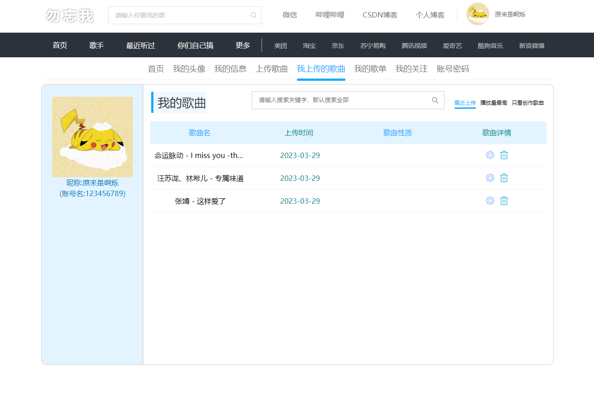

# Excellent-as-me-music
优我音乐平台：vue2、vuex、vue-router、axios、node、express。风格类似酷狗、哔哩哔哩。 

- 这是我在学习vue2的时候做的一个练手的项目，参考酷狗音乐和哔哩哔哩的UI。
- 这个项目主要提供想学习vue2或制作音乐项目的前端爱好者参考，可以当作学习或毕业设计使用，其它使用概不负责。
- 项目里面后面有一些迁移，会有一些bug，但是本人不再维护这个项目，有需要改动的话，有哪里看不懂的可以问我。
- 项目的接口文档当时没有整理，如果有同学愿意整理发出来也是非常感谢。

# 启动

安装依赖：前端 `yarn install` 服务端 `npm install`

前端 ： `npm run serve`

服务端 ： `npm start`

# 项目的一些截图

# 微信

非诚勿扰，技术交流，玩游戏可以加我哈。

